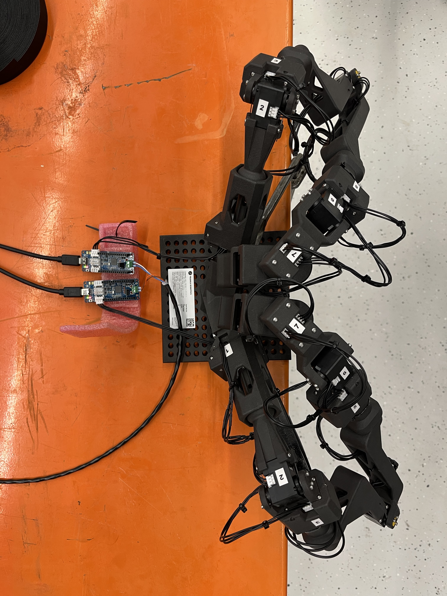

# Instructions for the user

The purpose of this exercise is to get familiar with the data collection process in a bimanual Franka Research 3 setup using the Gello arms teleoperation devices. In this exercise, you will try two cloth manipulation tasks:

- Fold the cloth: the cloth is positioned flat/crumpled on the table, and the goal is to fold it twice along the center line.
- Flatten the cloth: the cloth is positioned crumpled on the table, and the goal is to flatten it as much as possible. You can try 3 techniques to flatten the cloth:
    1. Flattening by stretching the cloth from its edges.
    2. Grab the cloth, swing it and place it back on the table in a flattened manner.
    3. Use the edge of the table to help flatten the cloth.

## How to collect an episode?

You can manage the whole process through Franka Data Collection UI. The following are the step-by-step instructions to collect an episode. You need at least 2 people to do this; in this scenario, person A manages the episode start/stop at the workstation, and person B does the teleoperation:

1. (For Person A) Navigate to the [Franka Data Collection UI](localhost:4000), it is one of the bookmarks on the browser. Below is the webpage that you should see. 

  

2. (For Person A) Make sure all boxes in the system status panel are green. (Don’t mind the Gripper boxes as they should turn green when starting teleoperation.)
3. (For Person A) Check whether all camera streams are working. Don't mind the lag/jitters on data collection camera  streams. If you want to see a smoother stream of the wrist or head cameras, you can view it directly in the ROS rqt viewer. Check the [Notes](#notes) section below for instructions. 
4. (For Person A) Click on `Start Teleoperation`.
5. (For Person B) Should pick up the Gello arms carefully and adopt a posture similar to that of the Franka arms and hold that posture.
6. (For Person A) While person B is holding still, click on `Reset Robot Position` in the UI; this adjusts the robot arms to Gello arm configuration, and the robot is ready to be teleoperated.
 **It is important to note that sudden and rapid movements by the teleoperator will cause the robot to enter emergency lock mode. In such a case, activate the emergency brakes, click on `Stop Teleoperation`, and inform your operator guide to resume operation.**

7. (For Person A) When ready, select your task using `Change Tasks` then press `Start Recording`. To get familiar with the teleoperation, you can choose `Testing` as for the task.
8. (For Person B) Perform their desired task using the Gello arms.
9.  (For Person A) Upon finishing the task, click `Stop Recording`. A menu will appear, allowing you to decide whether to save or discard your data. **Note that the system is still in the teleoperation mode.**
10.  (For Person A) Click on `Stop Teleoperation`
11.  (For Person B) Insert back the Gello arms into their calibration rods. Check the pictures below to see the correct configuration pose.

  
  

## How to see your collected data?

The data is recorded with MCAP format - a file format for multimodal log data. The format supports viewing and playing the data using the `rosbag` ROS package. 

### Locate the collected data
1. In the Franka Data Collection UI, navigate to the `EPISODES` tab
2. Using the date and time information, locate your data in the collected data list
3. Copy the data name hash (e.g., Episode `019c42f8-2fb2-7787-9d23-fc16538a736a`)
4. Press `Ctrl + alt + T` to open a new terminal window.
5. Type `terminator -l vis-bag` to open the visualization workspace.
6. Type `BAG_ID=<data_hash> docker compose up vis_bag`. This will load the cameras' data into rqt.  

## Notes

- Don’t mind the lag/jitters on data collection camera  streams, if you want to see a smoother stream of the wrist or head cameras, you can viewing in ROS rqt directly via:
  1. Press `Ctrl + alt + T` to open a new terminal window.
  2. Type `terminator -l vis-live` to open the visualization workspace.  This opens a ROS2 rqt window with preconfigured video streams of all three cameras.

- If the franka arm is blinking yellow, this is a warning indicating that one or some of the joints are near their limits. Recommended action would be to teleoperate back to a more centered pose and avoid aggressive motions that may cause the joints to hit their limits.

- Aggressive and too dynamic motions may cause the arms to activate their emergency mode and get locked, in such case:
  - Stop teleoperating via the Franka Data Collection UI.
  - If the Franka arms are blinking a red light, that means the emergency locks are activated and you need to inform your helper operator to resume data collection.
